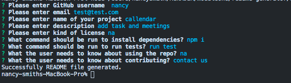
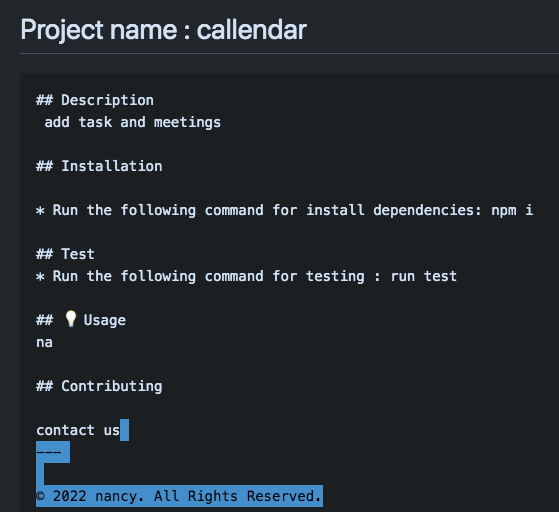

# readme-generator

When creating an open source project on GitHub, it’s important to have a high-quality README for the app. This should include what the app is for, how to use the app, how to install it, how to report issues, and how to make contributions&mdash;this last part increases the likelihood that other developers will contribute to the success of the project. 

You can quickly and easily create a README file by using this command-line application to generate one. This allows the project creator to devote more time to working on the project.


The application will be invoked by using the following command:

```bash
node index.js
```

## User Story

```md
AS A developer
I WANT a README generator
SO THAT I can quickly create a professional README for a new project
```


## Mock-Up

The following image shows the application's appearance and functionality:





* Video 


---

© 2022 Nancy. All Rights Reserved.
